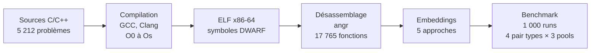

<h1 align="center">BCSD Benchmark</h1>

---

<p align="center">
<b>Détection de similarité de code binaire à partir d'implémentations multi-langages</b>
</p>

<p align="center">
<i>Construction d'un benchmark et évaluation comparative de cinq approches sur quatre niveaux de similarité.</i>
</p>

<p align="center">


</p>

## Contexte

Les modèles de détection de similarité de code binaire (BCSD) affichent des performances élevées sur les benchmarks standards (BinKit, BinaryCorp), mais ces benchmarks évaluent exclusivement la similarité entre recompilations du même code source. La question de savoir si ces modèles capturent une véritable similarité sémantique, ou s'ils exploitent des invariants de compilation, reste ouverte.

Ce projet construit un benchmark fondé sur du code de compétition algorithmique (RosettaCode, LeetCode, AtCoder) qui évalue quatre types de similarité de difficulté croissante : cross-compilateur, cross-optimisation, cross-implémentation (même algorithme, développeurs différents) et cross-langage (même algorithme, C vs C++). À partir de 5 212 problèmes et 17 765 fonctions désassemblées, cinq approches sont évaluées : PalmTree (pré-entraîné et fine-tuné par apprentissage contrastif), jTrans, REFuSE et une baseline statistique.

## Méthode

Les 27 940 fichiers sources C et C++ sont compilés en exécutables ELF complets avec GCC et Clang selon une matrice de 10 configurations (2 compilateurs, 5 niveaux d'optimisation O0 à Os) sur x86-64. Tous les binaires incluent les symboles de debug DWARF, qui permettent de filtrer les fonctions de runtime (startup, PLT, libc) et de ne conserver que les fonctions algorithmiques. Le désassemblage est effectué avec angr ; seules les fonctions d'au moins 5 instructions sont retenues.

Chaque fonction est ensuite représentée sous forme de vecteur par l'une des cinq approches évaluées. PalmTree et jTrans opèrent sur les instructions assembleur tokenisées ; REFuSE traite directement les octets bruts de la fonction depuis l'ELF ; la baseline extrait 16 features statistiques manuelles. PalmTree est également fine-tuné par apprentissage contrastif (perte InfoNCE) sur la partie entraînement du dataset, avec séparation au niveau des problèmes pour éviter le data leakage.

L'évaluation suit le protocole de Marcelli et al. : pour chaque paire positive, un pool de candidats est constitué du match positif et de distracteurs aléatoires. Le rang du match positif détermine les métriques (Recall@1, MRR, ROC AUC). Ce processus est répété 1 000 fois sur des pools de taille 100, 1 000 et 10 000.



## Structure du projet

```
bcsd-benchmark/
├── src/                        # Scripts du pipeline
│   ├── compile.py              # Compilation des sources en ELF
│   ├── disasm.py               # Désassemblage avec angr
│   ├── embed_palmtree.py       # Génération des embeddings PalmTree
│   ├── embed_jtrans.py         # Génération des embeddings jTrans
│   ├── embed_baseline.py       # Extraction de features statistiques (16 features)
│   ├── embed_refuse.py         # Génération des embeddings REFuSE (JAX/Flax)
│   ├── finetune_palmtree.py    # Fine-tuning contrastif de PalmTree
│   ├── benchmark.py            # Évaluation et calcul des métriques
│   ├── gcp_build.py            # Orchestration des VMs GCP
│   └── scrapers/               # Scripts de collecte du dataset
├── lib/                        # Code des modèles externes et poids pré-entraînés
│   ├── palmtree/               # Modèle transformer PalmTree
│   ├── jtrans/                 # Modèle jTrans
│   └── refuse/                 # Modèle REFuSE (JAX/Flax)
├── scripts/                    # Scripts shell de parallélisation pour GCP
├── data/                       # Échantillon de test pour validation locale
├── results/                    # Sorties du benchmark, métriques et graphes
├── config.yaml                 # Configuration du pipeline et du benchmark
└── requirements.txt            # Dépendances Python
```

## Installation

### Prérequis

- Python 3.10+
- GCC et Clang (étape de compilation)
- GPU compatible CUDA (optionnel, accélère la génération d'embeddings)

### Mise en place

```bash
git clone https://github.com/BelgacemS/bcsd-benchmark.git
cd bcsd-benchmark
python3 -m venv venv && source venv/bin/activate
pip install -r requirements.txt
```

### Configuration

Tous les paramètres du pipeline (compilateurs, niveaux d'optimisation, backend de désassemblage, approches d'embedding, métriques, tailles de pool) sont définis dans `config.yaml`.

Pour le déploiement sur GCP, le CLI `gcloud` doit être authentifié avec accès au bucket `gs://bscd-database/`.

## Utilisation

### Pipeline local (sample)

```bash
python3 src/compile.py --test       # Compiler les sources de test en ELF
python3 src/disasm.py --test        # Désassembler les binaires avec angr
python3 src/embed_palmtree.py       # Générer les embeddings PalmTree
python3 src/embed_baseline.py       # Calculer les vecteurs baseline
python3 src/benchmark.py            # Lancer l'évaluation
```

### Pipeline complet (GCP)

```bash
python3 src/gcp_build.py --phases compile disasm
python3 src/gcp_build.py --phases embed
python3 src/gcp_build.py --phases benchmark
```

### Fine-tuning

```bash
python3 src/finetune_palmtree.py    # Fine-tuning contrastif de PalmTree
```

## Données

Le dataset est construit à partir de trois plateformes de programmation compétitive : RosettaCode (~1 300 tâches), LeetCode (~3 200 tâches) et AtCoder (~1 370 tâches, seule source de cross-implémentation). Il totalise 27 940 fichiers sources en C et C++. Après compilation et désassemblage, 5 212 problèmes et 17 765 fonctions sont présents dans l'index d'embeddings.

Le projet inclut uniquement un petit échantillon de test dans `data/sources/_test/`, suffisant pour valider le pipeline localement. Le dataset complet (sources, binaires, désassemblage, embeddings) est hébergé sur Google Cloud Storage :

```bash
gsutil -m cp -r gs://bscd-database/sources/ data/sources/
gsutil -m cp -r gs://bscd-database/disasm/ data/disasm/
gsutil -m cp -r gs://bscd-database/embeddings/ data/embeddings/
```

## Résultats

Tous les résultats sont rapportés dans le cadre optimiste (noms de symboles DWARF disponibles pour le matching), avec 1 000 runs indépendants par configuration et jusqu'à 5 000 queries par run. PalmTree (ft) est évalué sur un split de test (2 695 fonctions) pour éviter le data leakage ; les autres approches utilisent l'ensemble complet (17 765 fonctions).

### Recall@1 (pool size = 100)

| Approche      | Cross-Compiler | Cross-Optim | Cross-Impl | Cross-Lang |
|---------------|:--------------:|:-----------:|:----------:|:----------:|
| Baseline      |          0.364 |       0.391 |      0.349 |      0.129 |
| PalmTree      |          0.438 |       0.488 |      0.436 |      0.155 |
| PalmTree (ft) |          0.634 |       0.579 |      0.468 |      0.121 |
| jTrans        |          0.511 |       0.615 |      0.453 |      0.071 |
| REFuSE        |          0.305 |       0.405 |      0.279 |      0.072 |

### Recall@1 (pool size = 10 000)

| Approche      | Cross-Compiler | Cross-Optim | Cross-Lang |
|---------------|:--------------:|:-----------:|:----------:|
| Baseline      |          0.081 |       0.218 |      0.017 |
| PalmTree      |          0.123 |       0.323 |      0.026 |
| PalmTree (ft) |          0.245 |       0.386 |      0.026 |
| jTrans        |          0.208 |       0.360 |      0.009 |
| REFuSE        |          0.038 |       0.196 |      0.009 |

En cross-compilateur, le fine-tuning contrastif de PalmTree améliore le Recall@1 de +20 points (63,4 % contre 43,8 %). En cross-optimisation, jTrans domine (61,5 %), cohérent avec son pré-entraînement sur BinaryCorp. En cross-langage, les scores chutent sous 16 %, révélant que les modèles actuels capturent des invariants de compilation plutôt qu'une véritable similarité sémantique. Les performances se dégradent de manière consistante quand la taille du pool augmente, conformément aux observations de Marcelli et al.

Les métriques détaillées, distributions de similarité, courbes ROC et heatmaps cross-compilateur sont disponibles dans `results/{approach}/`.

## Remerciements

Ce travail a été effectué dans le cadre de l'UE Projet de Recherche à Sorbonne Université. Nous remercions Nicolas Baskiotis et Benjamin Maudet pour leur encadrement tout au long de ce projet.
