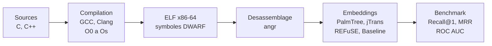

<h1 align="center">BCSD Benchmark</h1>

---

<p align="center">
<b>Evaluation des modeles de similarite binaire au-dela de la cross-compilation</b>
</p>

<p align="center">
<i>Un benchmark multi-niveaux pour la detection de similarite de code binaire : cross-compilation, cross-implementation et cross-langage.</i>
</p>

<p align="center">


</p>

## Contexte

Les modeles de Binary Code Similarity Detection (BCSD) sont generalement evalues sur un seul scenario : retrouver une meme fonction compilee avec des compilateurs ou niveaux d'optimisation differents. Ce cadre ne permet pas de determiner si les modeles capturent reellement la semantique du code binaire, ou s'ils exploitent des patterns syntaxiques preserves entre compilations.

Ce projet propose un benchmark qui evalue les approches BCSD a trois niveaux de difficulte croissante : cross-compilation (meme source, compilateur ou optimisation differente), cross-implementation (meme algorithme, implementations independantes dans le meme langage) et cross-langage (meme algorithme, langages sources differents). Le dataset est construit a partir de plateformes de programmation competitive (RosettaCode, LeetCode, AtCoder), qui fournissent naturellement plusieurs solutions independantes aux memes problemes algorithmiques. Cinq approches sont comparees : une baseline statistique, PalmTree (pre-entraine et fine-tune), jTrans et REFuSE.

## Methode

Les fichiers sources en C et C++ sont compiles en executables ELF x86-64 avec GCC et Clang sur cinq niveaux d'optimisation (O0 a Os). Tous les binaires incluent les symboles de debug DWARF, qui permettent de distinguer les fonctions utilisateur du code de runtime (routines de demarrage, stubs PLT, code libc). Le desassemblage est effectue avec angr, et seules les fonctions depassant un seuil minimal d'instructions sont conservees.

Chaque fonction est ensuite representee sous forme de vecteur par l'une des approches evaluees. PalmTree et jTrans operent sur les instructions assembleur tokenisees ; REFuSE traite directement les octets bruts de la fonction depuis l'ELF ; la baseline extrait 16 features statistiques (nombre d'instructions, ratios d'operandes registre/memoire, statistiques de flot de controle). PalmTree est egalement fine-tune avec un objectif d'apprentissage contrastif sur la partie entrainement du dataset.

Le benchmark construit des paires de fonctions selon quatre niveaux de similarite (cross-compilateur, cross-optimisation, cross-implementation, cross-langage) et mesure les performances de recherche via Recall@1, MRR et ROC AUC. Chaque configuration est testee sur des pools de candidats de taille 100, 1 000 et 10 000, avec 1 000 runs independants par configuration.



## Structure du repository

```
bcsd-benchmark/
├── src/                        # Scripts du pipeline
│   ├── compile.py              # Compilation des sources en ELF
│   ├── disasm.py               # Desassemblage avec angr
│   ├── embed_palmtree.py       # Generation des embeddings PalmTree
│   ├── embed_jtrans.py         # Generation des embeddings jTrans
│   ├── embed_baseline.py       # Extraction de features statistiques (16 features)
│   ├── embed_refuse.py         # Generation des embeddings REFuSE (JAX/Flax)
│   ├── finetune_palmtree.py    # Fine-tuning contrastif de PalmTree
│   ├── benchmark.py            # Evaluation et calcul des metriques
│   ├── gcp_build.py            # Orchestration des VMs GCP
│   └── scrapers/               # Scripts de collecte du dataset
├── lib/                        # Code des modeles externes et poids pre-entraines
│   ├── palmtree/               # Modele transformer PalmTree
│   ├── jtrans/                 # Modele jTrans
│   └── refuse/                 # Modele REFuSE (JAX/Flax)
├── scripts/                    # Scripts shell de parallelisation pour GCP
├── data/                       # Binaires, desassemblage, embeddings (hors VCS)
├── results/                    # Sorties du benchmark, metriques et graphes
├── config.yaml                 # Configuration du pipeline et du benchmark
└── requirements.txt            # Dependances Python
```

## Installation

### Pre-requis

- Python >= 3.10
- GCC et Clang (etape de compilation)
- GPU compatible CUDA (optionnel, accelere la generation d'embeddings)

### Mise en place

```bash
git clone https://github.com/[YOUR_USERNAME]/bcsd-benchmark.git
cd bcsd-benchmark
python3 -m venv venv && source venv/bin/activate
pip install -r requirements.txt
```

### Configuration

Tous les parametres du pipeline (compilateurs, niveaux d'optimisation, backend de desassemblage, approches d'embedding, metriques, tailles de pool) sont definis dans `config.yaml`.

Pour le deploiement sur GCP, le CLI `gcloud` doit etre authentifie avec acces au bucket `gs://bscd-database/`.

## Utilisation

### Pipeline local (sample)

```bash
python3 src/compile.py --test       # Compiler les sources de test en ELF
python3 src/disasm.py --test        # Desassembler les binaires avec angr
python3 src/embed_palmtree.py       # Generer les embeddings PalmTree
python3 src/embed_baseline.py       # Calculer les vecteurs baseline
python3 src/benchmark.py            # Lancer l'evaluation
```

### Pipeline complet (GCP)

```bash
python3 src/gcp_build.py --phases compile disasm   # VM CPU (96 coeurs)
python3 src/gcp_build.py --phases embed             # VM GPU (NVIDIA T4)
python3 src/gcp_build.py --phases benchmark          # VM CPU
```

### Fine-tuning

```bash
python3 src/finetune_palmtree.py    # Fine-tuning contrastif de PalmTree
```

## Donnees

Le dataset est construit a partir de trois plateformes de programmation competitive : RosettaCode, LeetCode et AtCoder. Il contient environ 28 000 fichiers sources en C et C++, couvrant pres de 6 000 problemes algorithmiques distincts. Chaque probleme possede typiquement plusieurs implementations independantes, ce qui rend possible l'evaluation cross-implementation et cross-langage.

Les fichiers sources, binaires compiles, sorties de desassemblage et embeddings pre-calcules sont heberges sur Google Cloud Storage :

```bash
gsutil -m cp -r gs://bscd-database/sources/ data/sources/
gsutil -m cp -r gs://bscd-database/disasm/ data/disasm/
gsutil -m cp -r gs://bscd-database/embeddings/ data/embeddings/
```

Un petit echantillon de test est disponible dans `data/sources/_test/` pour le developpement local sans acces GCP.

## Resultats

Tous les resultats sont rapportes dans le cadre optimiste (noms de symboles DWARF disponibles pour le matching de fonctions), avec 1 000 runs independants par configuration et jusqu'a 5 000 queries par run. La variante fine-tunee de PalmTree est evaluee sur un split de test (2 695 fonctions) pour eviter le data leakage ; les autres approches utilisent l'ensemble complet (17 765 fonctions).

### Recall@1 (pool size = 100)

| Approche      | Cross-Compiler | Cross-Optim | Cross-Impl | Cross-Lang |
|---------------|:--------------:|:-----------:|:----------:|:----------:|
| Baseline      |          0.364 |       0.391 |      0.349 |      0.129 |
| PalmTree      |          0.438 |       0.488 |      0.436 |      0.155 |
| PalmTree (ft) |          0.634 |       0.579 |      0.468 |      0.121 |
| jTrans        |          0.511 |       0.615 |      0.453 |      0.071 |
| REFuSE        |          0.305 |       0.405 |      0.279 |      0.072 |

### Recall@1 (pool size = 10 000)

| Approche      | Cross-Compiler | Cross-Optim | Cross-Impl | Cross-Lang |
|---------------|:--------------:|:-----------:|:----------:|:----------:|
| Baseline      |          0.081 |       0.218 |      0.132 |      0.017 |
| PalmTree      |          0.123 |       0.323 |      0.194 |      0.026 |
| PalmTree (ft) |          0.245 |       0.386 |      0.244 |      0.026 |
| jTrans        |          0.208 |       0.360 |      0.172 |      0.009 |
| REFuSE        |          0.038 |       0.196 |      0.097 |      0.009 |

Les performances se degradent de maniere consistante quand la taille du pool augmente de 100 a 10 000, conformement aux observations de Marcelli et al. (2022). Le fine-tuning apporte des gains importants sur les taches de cross-compilation mais ne se transfere pas au cadre cross-langage. La recherche cross-langage reste proche du niveau aleatoire pour toutes les approches evaluees, suggerant une limitation fondamentale des methodes d'embedding actuelles lorsque la structure du code source diverge.

Les metriques detaillees, distributions de similarite, courbes ROC et heatmaps cross-compilateur sont disponibles dans `results/{approach}/`.

## Citation

```bibtex
@misc{bcsd-benchmark-2025,
  author       = {[YOUR NAME]},
  title        = {{BCSD Benchmark} : \'Evaluation des mod\`eles de similarit\'e
                  binaire au-del\`a de la cross-compilation},
  year         = {2025},
  institution  = {Sorbonne Universit\'{e}},
  url          = {https://github.com/[YOUR_USERNAME]/bcsd-benchmark}
}
```

## Licence

Non encore specifiee. Un fichier `LICENSE` doit etre ajoute au repository.

## Remerciements

Ce travail a ete realise a Sorbonne Universite dans le cadre d'un projet de recherche du departement d'informatique. Nous remercions [nom de l'encadrant] pour son encadrement tout au long de ce projet.
