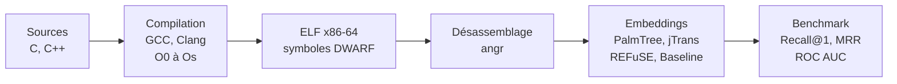

<h1 align="center">BCSD Benchmark</h1>

---

<p align="center">
<b>Évaluation des modèles de similarité binaire au-delà de la cross-compilation</b>
</p>

<p align="center">
<i>Un benchmark multi-niveaux pour la détection de similarité de code binaire : cross-compilation, cross-implémentation et cross-langage.</i>
</p>

<p align="center">


</p>

## Contexte

Les modèles de Binary Code Similarity Detection (BCSD) sont généralement évalués sur un seul scénario : retrouver une même fonction compilée avec des compilateurs ou niveaux d'optimisation différents. Ce cadre ne permet pas de déterminer si les modèles capturent réellement la sémantique du code binaire, ou s'ils exploitent des patterns syntaxiques préservés entre compilations.

Ce projet propose un benchmark qui évalue les approches BCSD à trois niveaux de difficulté croissante : cross-compilation (même source, compilateur ou optimisation différente), cross-implémentation (même algorithme, implémentations indépendantes dans le même langage) et cross-langage (même algorithme, langages sources différents). Le dataset est construit à partir de plateformes de programmation compétitive (RosettaCode, LeetCode, AtCoder), qui fournissent naturellement plusieurs solutions indépendantes aux mêmes problèmes algorithmiques. Cinq approches sont comparées : une baseline statistique, PalmTree (pré-entraîné et fine-tuné), jTrans et REFuSE.

## Méthode

Les fichiers sources en C et C++ sont compilés en exécutables ELF x86-64 avec GCC et Clang sur cinq niveaux d'optimisation (O0 à Os). Tous les binaires incluent les symboles de debug DWARF, qui permettent de distinguer les fonctions utilisateur du code de runtime (routines de démarrage, stubs PLT, code libc). Le désassemblage est effectué avec angr, et seules les fonctions dépassant un seuil minimal d'instructions sont conservées.

Chaque fonction est ensuite représentée sous forme de vecteur par l'une des approches évaluées. PalmTree et jTrans opèrent sur les instructions assembleur tokenisées ; REFuSE traite directement les octets bruts de la fonction depuis l'ELF ; la baseline extrait 16 features statistiques (nombre d'instructions, ratios d'opérandes registre/mémoire, statistiques de flot de contrôle). PalmTree est également fine-tuné avec un objectif d'apprentissage contrastif sur la partie entraînement du dataset.

Le benchmark construit des paires de fonctions selon quatre niveaux de similarité (cross-compilateur, cross-optimisation, cross-implémentation, cross-langage) et mesure les performances de recherche via Recall@1, MRR et ROC AUC. Chaque configuration est testée sur des pools de candidats de taille 100, 1 000 et 10 000, avec 1 000 runs indépendants par configuration.



## Structure du repository

```
bcsd-benchmark/
├── src/                        # Scripts du pipeline
│   ├── compile.py              # Compilation des sources en ELF
│   ├── disasm.py               # Désassemblage avec angr
│   ├── embed_palmtree.py       # Génération des embeddings PalmTree
│   ├── embed_jtrans.py         # Génération des embeddings jTrans
│   ├── embed_baseline.py       # Extraction de features statistiques (16 features)
│   ├── embed_refuse.py         # Génération des embeddings REFuSE (JAX/Flax)
│   ├── finetune_palmtree.py    # Fine-tuning contrastif de PalmTree
│   ├── benchmark.py            # Évaluation et calcul des métriques
│   ├── gcp_build.py            # Orchestration des VMs GCP
│   └── scrapers/               # Scripts de collecte du dataset
├── lib/                        # Code des modèles externes et poids pré-entraînés
│   ├── palmtree/               # Modèle transformer PalmTree
│   ├── jtrans/                 # Modèle jTrans
│   └── refuse/                 # Modèle REFuSE (JAX/Flax)
├── scripts/                    # Scripts shell de parallélisation pour GCP
├── data/                       # Binaires, désassemblage, embeddings (hors VCS)
├── results/                    # Sorties du benchmark, métriques et graphes
├── config.yaml                 # Configuration du pipeline et du benchmark
└── requirements.txt            # Dépendances Python
```

## Installation

### Prérequis

- Python 3.10+
- GCC et Clang (étape de compilation)
- GPU compatible CUDA (optionnel, accélère la génération d'embeddings)

### Mise en place

```bash
git clone https://github.com/[YOUR_USERNAME]/bcsd-benchmark.git
cd bcsd-benchmark
python3 -m venv venv && source venv/bin/activate
pip install -r requirements.txt
```

### Configuration

Tous les paramètres du pipeline (compilateurs, niveaux d'optimisation, backend de désassemblage, approches d'embedding, métriques, tailles de pool) sont définis dans `config.yaml`.

Pour le déploiement sur GCP, le CLI `gcloud` doit être authentifié avec accès au bucket `gs://bscd-database/`.

## Utilisation

### Pipeline local (sample)

```bash
python3 src/compile.py --test       # Compiler les sources de test en ELF
python3 src/disasm.py --test        # Désassembler les binaires avec angr
python3 src/embed_palmtree.py       # Générer les embeddings PalmTree
python3 src/embed_baseline.py       # Calculer les vecteurs baseline
python3 src/benchmark.py            # Lancer l'évaluation
```

### Pipeline complet (GCP)

```bash
python3 src/gcp_build.py --phases compile disasm
python3 src/gcp_build.py --phases embed
python3 src/gcp_build.py --phases benchmark
```

### Fine-tuning

```bash
python3 src/finetune_palmtree.py    # Fine-tuning contrastif de PalmTree
```

## Données

Le dataset est construit à partir de trois plateformes de programmation compétitive : RosettaCode, LeetCode et AtCoder. Il contient environ 28 000 fichiers sources en C et C++, couvrant près de 6 000 problèmes algorithmiques distincts. Chaque problème possède typiquement plusieurs implémentations indépendantes, ce qui rend possible l'évaluation cross-implémentation et cross-langage.

Le repository inclut uniquement un petit échantillon de test dans `data/sources/_test/`, suffisant pour valider le pipeline localement. Le dataset complet (sources, binaires, désassemblage, embeddings) est hébergé sur Google Cloud Storage :

```bash
gsutil -m cp -r gs://bscd-database/sources/ data/sources/
gsutil -m cp -r gs://bscd-database/disasm/ data/disasm/
gsutil -m cp -r gs://bscd-database/embeddings/ data/embeddings/
```

## Résultats

Tous les résultats sont rapportés dans le cadre optimiste (noms de symboles DWARF disponibles pour le matching de fonctions), avec 1 000 runs indépendants par configuration et jusqu'à 5 000 queries par run. La variante fine-tunée de PalmTree est évaluée sur un split de test (2 695 fonctions) pour éviter le data leakage ; les autres approches utilisent l'ensemble complet (17 765 fonctions).

### Recall@1 (pool size = 100)

| Approche      | Cross-Compiler | Cross-Optim | Cross-Impl | Cross-Lang |
|---------------|:--------------:|:-----------:|:----------:|:----------:|
| Baseline      |          0.364 |       0.391 |      0.349 |      0.129 |
| PalmTree      |          0.438 |       0.488 |      0.436 |      0.155 |
| PalmTree (ft) |          0.634 |       0.579 |      0.468 |      0.121 |
| jTrans        |          0.511 |       0.615 |      0.453 |      0.071 |
| REFuSE        |          0.305 |       0.405 |      0.279 |      0.072 |

### Recall@1 (pool size = 10 000)

| Approche      | Cross-Compiler | Cross-Optim | Cross-Impl | Cross-Lang |
|---------------|:--------------:|:-----------:|:----------:|:----------:|
| Baseline      |          0.081 |       0.218 |      0.132 |      0.017 |
| PalmTree      |          0.123 |       0.323 |      0.194 |      0.026 |
| PalmTree (ft) |          0.245 |       0.386 |      0.244 |      0.026 |
| jTrans        |          0.208 |       0.360 |      0.172 |      0.009 |
| REFuSE        |          0.038 |       0.196 |      0.097 |      0.009 |

Les performances se dégradent de manière consistante quand la taille du pool augmente de 100 à 10 000, conformément aux observations de Marcelli et al. (2022). Le fine-tuning apporte des gains importants sur les tâches de cross-compilation mais ne se transfère pas au cadre cross-langage. La recherche cross-langage reste proche du niveau aléatoire pour toutes les approches évaluées, suggérant une limitation fondamentale des méthodes d'embedding actuelles lorsque la structure du code source diverge.

Les métriques détaillées, distributions de similarité, courbes ROC et heatmaps cross-compilateur sont disponibles dans `results/{approach}/`.

## Remerciements

Ce travail a été réalisé à Sorbonne Université dans le cadre d'un projet de recherche du département d'informatique. Nous remercions Nicolas Baskiotis et Benjamin Maudet pour leur encadrement tout au long de ce projet.
