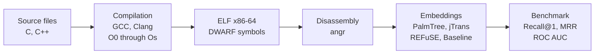

<h1 align="center">BCSD Benchmark</h1>

---

<p align="center">
<b>Evaluating binary code similarity models beyond cross-compilation</b>
</p>

<p align="center">
<i>A multi-level benchmark for binary code similarity detection across compilers, implementations, and source languages.</i>
</p>

<p align="center">


</p>

## Overview

Binary Code Similarity Detection (BCSD) models are commonly benchmarked on a single scenario: retrieving the same function compiled under different settings. This setup alone does not establish whether the models genuinely capture the semantic behavior of binary code, or whether they rely on syntactic patterns that happen to be preserved across compilations.

This project introduces a benchmark that evaluates BCSD approaches at three levels of increasing difficulty: cross-compilation (same source, different compiler or optimization level), cross-implementation (same algorithm, independently written in the same language), and cross-language (same algorithm, different source languages). The dataset is built from competitive programming platforms (RosettaCode, LeetCode, AtCoder), which provide multiple independent solutions to identical algorithmic problems. Five approaches are compared: a statistical feature baseline, PalmTree (pre-trained and fine-tuned), jTrans, and REFuSE.

## Method

Source files in C and C++ are compiled into x86-64 ELF executables using GCC and Clang across five optimization levels (O0 through Os). All binaries include DWARF debug symbols, which allow the pipeline to distinguish user-written functions from runtime and library code (startup routines, PLT stubs, libc internals). Disassembly is performed with angr, and only functions exceeding a minimum instruction count are retained.

Each function is then embedded into a fixed-dimensional vector by one of the evaluated approaches. PalmTree and jTrans operate on tokenized assembly instructions; REFuSE processes raw function bytes directly from the ELF; the baseline extracts 16 hand-crafted statistical features (instruction counts, register and memory operand ratios, control flow statistics). PalmTree is additionally fine-tuned using a contrastive learning objective on the training portion of the dataset.

The benchmark constructs function pairs at four similarity levels (cross-compiler, cross-optimization, cross-implementation, cross-language) and evaluates retrieval performance using Recall@1, MRR, and ROC AUC. Each configuration is tested over randomized candidate pools of size 100, 1,000, and 10,000, with 1,000 independent runs per setting to produce statistically robust estimates.



## Repository structure

```
bcsd-benchmark/
├── src/                        # Pipeline scripts
│   ├── compile.py              # Source compilation to ELF executables
│   ├── disasm.py               # Binary disassembly with angr
│   ├── embed_palmtree.py       # PalmTree embedding generation
│   ├── embed_jtrans.py         # jTrans embedding generation
│   ├── embed_baseline.py       # Statistical feature extraction (16 features)
│   ├── embed_refuse.py         # REFuSE embedding generation (JAX/Flax)
│   ├── finetune_palmtree.py    # Contrastive fine-tuning of PalmTree
│   ├── benchmark.py            # Evaluation and metric computation
│   ├── gcp_build.py            # GCP VM orchestration
│   └── scrapers/               # Dataset collection scripts
├── lib/                        # External model code and pre-trained weights
│   ├── palmtree/               # PalmTree transformer model
│   ├── jtrans/                 # jTrans model
│   └── refuse/                 # REFuSE model (JAX/Flax)
├── scripts/                    # Shell scripts for GCP parallelization
├── data/                       # Binaries, disassembly, embeddings (not in VCS)
├── results/                    # Benchmark outputs, metrics, and plots
├── config.yaml                 # Pipeline and benchmark configuration
└── requirements.txt            # Python dependencies
```

## Setup

### Prerequisites

- Python >= 3.10
- GCC and Clang (for the compilation stage)
- CUDA-capable GPU (optional, speeds up embedding generation)

### Installation

```bash
git clone https://github.com/[YOUR_USERNAME]/bcsd-benchmark.git
cd bcsd-benchmark
python3 -m venv venv && source venv/bin/activate
pip install -r requirements.txt
```

### Configuration

All pipeline parameters (compilers, optimization levels, disassembly backend, embedding approaches, benchmark metrics, pool sizes) are defined in `config.yaml`.

For GCP deployment, the `gcloud` CLI must be authenticated with access to the project hosting the `gs://bscd-database/` storage bucket.

## Usage

### Local pipeline (sample)

```bash
python3 src/compile.py --test       # Compile test sources to ELF executables
python3 src/disasm.py --test        # Disassemble binaries with angr
python3 src/embed_palmtree.py       # Generate PalmTree embeddings
python3 src/embed_baseline.py       # Compute baseline feature vectors
python3 src/benchmark.py            # Run the benchmark evaluation
```

### Full pipeline (GCP)

```bash
python3 src/gcp_build.py --phases compile disasm   # CPU VM (96 cores)
python3 src/gcp_build.py --phases embed             # GPU VM (NVIDIA T4)
python3 src/gcp_build.py --phases benchmark          # CPU VM
```

### Fine-tuning

```bash
python3 src/finetune_palmtree.py    # Contrastive fine-tuning of PalmTree
```

## Data

The dataset is constructed from three competitive programming platforms: RosettaCode, LeetCode, and AtCoder. It contains approximately 28,000 source files in C and C++, covering nearly 6,000 distinct algorithmic problems. Each problem typically has multiple independent implementations, which enables cross-implementation and cross-language evaluation.

Source files, compiled binaries, disassembly outputs, and pre-computed embeddings are hosted on Google Cloud Storage:

```bash
gsutil -m cp -r gs://bscd-database/sources/ data/sources/
gsutil -m cp -r gs://bscd-database/disasm/ data/disasm/
gsutil -m cp -r gs://bscd-database/embeddings/ data/embeddings/
```

A small test sample is available in `data/sources/_test/` for local development without GCP access.

## Results

All results are reported under the optimistic evaluation setting (DWARF symbol names available for function matching), with 1,000 independent runs per configuration and up to 5,000 queries per run. The fine-tuned PalmTree variant is evaluated on a held-out test split (2,695 functions) to prevent data leakage; all other approaches use the full function set (17,765 functions).

### Recall@1 (pool size = 100)

| Approach      | Cross-Compiler | Cross-Optim | Cross-Impl | Cross-Lang |
|---------------|:--------------:|:-----------:|:----------:|:----------:|
| Baseline      |          0.364 |       0.391 |      0.349 |      0.129 |
| PalmTree      |          0.438 |       0.488 |      0.436 |      0.155 |
| PalmTree (ft) |          0.634 |       0.579 |      0.468 |      0.121 |
| jTrans        |          0.511 |       0.615 |      0.453 |      0.071 |
| REFuSE        |          0.305 |       0.405 |      0.279 |      0.072 |

### Recall@1 (pool size = 10,000)

| Approach      | Cross-Compiler | Cross-Optim | Cross-Impl | Cross-Lang |
|---------------|:--------------:|:-----------:|:----------:|:----------:|
| Baseline      |          0.081 |       0.218 |      0.132 |      0.017 |
| PalmTree      |          0.123 |       0.323 |      0.194 |      0.026 |
| PalmTree (ft) |          0.245 |       0.386 |      0.244 |      0.026 |
| jTrans        |          0.208 |       0.360 |      0.172 |      0.009 |
| REFuSE        |          0.038 |       0.196 |      0.097 |      0.009 |

Performance degrades consistently as pool size increases from 100 to 10,000, in line with observations by Marcelli et al. (2022). Fine-tuning yields substantial gains on cross-compilation tasks but does not transfer to the cross-language setting. Cross-language retrieval remains near chance level for all evaluated approaches, suggesting a fundamental limitation of current embedding methods when source-level structure diverges.

Detailed per-approach metrics, similarity distributions, ROC curves, and cross-compiler heatmaps are available in `results/{approach}/`.

## Citation

```bibtex
@misc{bcsd-benchmark-2025,
  author       = {[YOUR NAME]},
  title        = {{BCSD Benchmark}: Evaluating Binary Code Similarity Models
                  Beyond Cross-Compilation},
  year         = {2025},
  institution  = {Sorbonne Universit\'{e}},
  url          = {https://github.com/[YOUR_USERNAME]/bcsd-benchmark}
}
```

## License

Not yet specified. A `LICENSE` file should be added to the repository.

## Acknowledgments

This work was conducted at Sorbonne Universit&eacute; as part of a research project in the Computer Science department. We thank [supervisor name] for guidance throughout this project.
